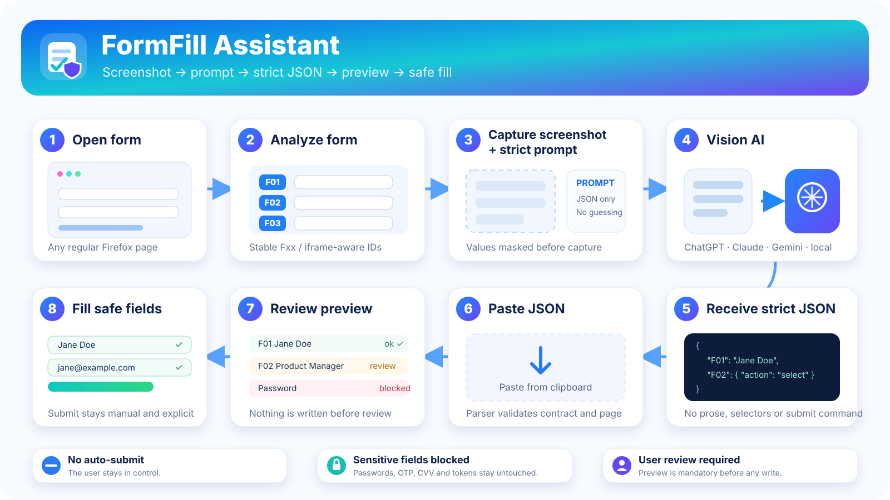

<p align="center">
  
</p>

<h1 align="center">FormFill Assistant</h1>

<p align="center">
  面向 Firefox 的安全型 AI 表单填写扩展。<br/>
  <strong>截图 → 严格提示词 → JSON → 预览 → 安全填写。绝不自动提交。</strong>
</p>

<p align="center">
  <a href="README.md">Русский</a> ·
  <a href="README.en.md">English</a> ·
  <a href="README.zh-CN.md">简体中文</a>
</p>

<p align="center">
  <a href="https://github.com/f2re/firefox-formfill-assist/actions/workflows/ci.yml"></a>
  <a href="https://github.com/f2re/firefox-formfill-assist/releases/latest"></a>
  
</p>

---

## 项目理念

视觉模型擅长理解表单截图，但不应该直接控制浏览器 DOM。FormFill Assistant 将职责拆开：

- AI 负责判断 **应该填写什么**；
- 扩展负责确定 **应该写入哪里、如何写入**；
- 每个字段都有临时稳定 ID，例如 `F01`、`I1-F02`、`P2-F03`；
- AI 返回结果必须绑定当前 `pageFingerprint`；
- 写入前必须经过 preview；
- 密码、OTP、CVV、token 等敏感字段会被阻止；
- 页面跳转和 Submit 始终由用户手动完成。

## 工作流程

<p align="center">
  
</p>

1. 打开目标表单。
2. 在 sidebar 中点击分析，字段会获得 Fxx ID。
3. 点击 **“截图 + 提示词”**，扩展会临时遮挡当前可编辑字段的值。
4. 将 PNG 粘贴到支持视觉能力的 AI。
5. 从扩展复制动态提示词，并粘贴到同一个对话。
6. AI 只返回严格 JSON。
7. 将 JSON 粘贴回 FormFill Assistant。
8. 检查强制 preview。
9. 填写明确且允许的字段。
10. 最后人工检查页面，并手动提交。

## 支持的表单能力

- input / textarea / date / number / email / tel / contenteditable；
- native select、radio、checkbox；
- ARIA combobox / autocomplete；
- React / Vue 风格 controlled inputs；
- same-origin iframe：`I<n>-Fxx`；
- open Shadow DOM；
- SPA route 变更检测；
- MutationObserver 动态表单；
- 多页手动 session：`P1-Fxx`、`P2-Fxx`、`P1-I1-F02`；
- 基于 confidence 的 select/combobox 匹配；
- Undo 和不保存字段值的本地历史。

## 安全模型

FormFill Assistant **不是** 一个允许 AI 任意控制浏览器的 agent。

- 无后端服务器；
- 无 telemetry / analytics；
- 不会偷偷上传表单数据；
- JSON 协议中不存在 submit / click / navigation 操作；
- password / OTP / CVV / token-like 字段会被阻止；
- 未知 Fxx 不会被重定向到“相似字段”；
- `pageFingerprint` 不匹配时停止执行；
- 模糊值进入 review，不会自动写入；
- 页面 label/options 中的 prompt injection 被视为不可信页面文本。

详细威胁模型见 [`SECURITY.md`](SECURITY.md)。

## 安装

从 [GitHub Releases](https://github.com/f2re/firefox-formfill-assist/releases/latest) 下载最新版本。

普通 Firefox 需要 Mozilla 签名的 XPI。Release pipeline 支持 AMO unlisted signing，需要仓库配置：

```text
WEB_EXT_API_KEY     = AMO JWT issuer
WEB_EXT_API_SECRET  = AMO JWT secret
```

详细步骤见 [`docs/FIREFOX_SIGNING.md`](docs/FIREFOX_SIGNING.md)。

开发模式可在 `about:debugging#/runtime/this-firefox` 中加载 `dist/manifest.json`。

## JSON 协议

```json
{
  "version": 1,
  "pageFingerprint": "fp-current-page",
  "fields": {
    "F01": "张三",
    "F02": {
      "action": "select",
      "value": "北京"
    },
    "F03": {
      "action": "check"
    }
  }
}
```

未知值应直接省略，不要用 `null`、空字符串、`false` 或 `0` 代替未知信息。

标准 AI 提示词保存在主 [`README.md`](README.md) 中，也可以直接从扩展 UI 复制。单元测试会逐字节验证 README 提示词与 runtime template 一致。

## 开发

要求：Node.js 22+、Firefox 126+。

```bash
npm ci
npm run check
npm run build
npm run lint:extension
npm run package
```

Firefox E2E：

```bash
npx playwright install firefox
npm run test:e2e
```

## Release pipeline

发布流程依次执行：

1. Firefox E2E safety matrix；
2. version / TypeScript / unit tests；
3. Vite build；
4. Mozilla `web-ext lint`；
5. deterministic packaging 校验；
6. production release 强制 AMO 签名；
7. immutable Git tag 与 GitHub Release。

没有 AMO credentials 时，production release 会故意失败，不会把 unsigned XPI 当作正式版本发布。

## 文档

- [`README.md`](README.md) — 俄语 / 主文档；
- [`README.en.md`](README.en.md) — English；
- [`docs/AI_HANDOFF.md`](docs/AI_HANDOFF.md) — screenshot / prompt handoff；
- [`docs/FIREFOX_SIGNING.md`](docs/FIREFOX_SIGNING.md) — Firefox 签名；
- [`SECURITY.md`](SECURITY.md) — 安全模型；
- [`CONTRIBUTING.md`](CONTRIBUTING.md) — 贡献指南。

---

<p align="center"><strong>AI 决定填写什么；FormFill Assistant 决定写到哪里、如何安全写入。</strong></p>
